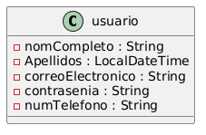
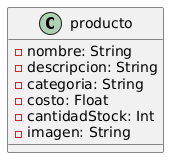
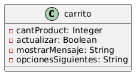
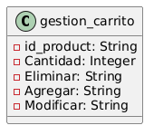
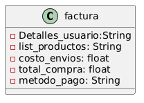

# Proyecto Sistema Carrito de Compras

### Requerimientos funcionales
---
### 1. **RF1** Registro e Inicio de Sesión.
---
#### 2. **Descripción** 
---
El sistema debe permitir a los usuarios registrarse y luego iniciar sesión para acceder al carrito de compras.

#### 3. **Entrada de Datos**
---
+ Nombre completo.
+ Apellido completo. (opcional)
+ Correo electrónico.
+ Contraseña. 
+ Número de Teléfono. (opcional)

#### 4. **Flujo normal**
---
- Usuario accede a la página mediante su url.
    - Mostrar un enlace para registrarse si no posee una cuenta.
    - Mostrar información sobre algún descuento o producto de interes.

- Usuario se autentica en la página.
    - Validar campos en tiempo real.
    - Enviar correo de verificación.

- No coinciden las entradas con la base de datos.
    - Ofrecer la opción de recuperar la Contrañesa.
    - Permitir reintentar el inicio de sesión.

#### 4.1 **Precondiciones**
---

- Acceso a internet.
- Requisito de equipos funcionales.

##### 4.2 **Postcondiciones**
---
+ Registro exitoso.
+ Inicio de sesión exitoso.
+ Sesión activada.

##### 5. **Diagrama de clases**
---

### 1. **RF2** Catálogo de Productos
---
#### 2. **Descripción** 
---
Los usuarios deben poder buscar y ver productos con nombre, descripción, precio y cantidad en stock.

#### 3. **Entrada de Datos**
---
- Palabra clave de búsqueda.
    - Donde el usuario pueda ingresar términos para buscar productos específicos por nombre o descripción.
- Categoría.
    - Un menú desplegable o lista donde se pueda seleccionar productos por categoria.
- Ordenar por.
    - Que el usuario tenga la posibilidad de filtrar (ej. Precio, más vendido, nuevos).
- Información del producto.
    - Que este contenta el nombre, una descripción, su costo, cantidad de stock y una imagen del mismo.

#### 4. **Flujo normal**
---
- Usuario accede a la página del catálogo de productos.
    - Mostrar un mensaje de bienvenida o tutorial sobre como navegar por él.
- Usuario ingresa una palabra clave en la barra de búsqueda.
    - Validación de la entrada (ej. Si está vacía, sugerir términos relacionados mientras el usuario escribe).
- Usuario revisa los productos listados.
    - Permitir ver más detalles del producto al hacer clic.
- Se agregan produtos al carrito.
    - Confirmación de la acción.
    - Ofrecer opción de continuar comprando o ir al carrito.

#### 4.1 **Precondiciones**
---
+ Base de datos de productos disponible.
+ Catálogo actualizado.
    
#### 4.2 **Postcondiciones**
---
+ Visualización de productos.
+ Estado del carrito actualizado.
+ Registro de interacciones.

##### 5. **Diagrama de clases**
---

### 1. **RF3** Agregar Productos al Carrito
---
#### 2. **Descripción** 
---
El sistema debe permitir agregar productos al carrito, especificando la cantidad.

#### 3. **Entrada de Datos**
---
+ Cantidad de productos (individualmente, o por lista).
+ Método de envío (ej. Estándar, express, etc).
+ Personalización (ej. Tamaño, color, etc).

#### 4. **Flujo normal**
---
- Usuario selecciona cantidad.
    - Después de visualizar el producto.
- Usuario selecciona opciones de personalización.
    - Tamaño, color, variantes, etc.
- Se hace clic en el botón "Agregar al carrito".
    - Se confima con un mensaje emergente.
    - actualización del carrito.
- Decidión sobre que hacer a continuación.
    - Ofrecer opciones como continuar comprando, ver carrito o proceder al pago.

#### 4.1 **Precondiciones**
---
+ Usuario debe estar autenticado.
+ Catálogo de productos disponible.
+ Productos visibles.

#### 4.2 **Poscondiciones**
---
+ Producto agregado al carrito.
+ Confirmación de la adición.
+ Interacción con el carrito.
+ Registro de acciones.

##### 5. **Diagrama de clases**
---

### 1. **RF4** Gestión del Carrito de Compras
---
#### 2. **Descripción** 
---
Los usuarios deben poder visualizar el carrito, modificar cantidades o eliminar productos.

#### 3. **Entrada de Datos**
---
+ ID del producto.
+ Cantidad.
+ Eliminar.
+ Agregar.
+ Modificar.

#### 4. **Flujo normal**
---
- Acceso al carrito de compras.
    - mostrando un resumen del contenido del carrito.
- Revisión de los productos.
    - Muestra en detalle cada producto.
- Modificación si es necesaria.
    - Si desea eliminar un artículo de la compra o si desea añadir más.
    - Mostrar un mensaje de la confirmación.
- Usuario revisa el subtotal, impuestos y total general.
    - Se valida algún código de descuento.
    - Actualiza automaticación el total general.

#### 4.1 **Precondiciones**
+ Carrito con al menos un producto.
#### 4.2 **Poscondiciones**
---
+ Estado actual del carrito.
+ Subtotales, impuestos y total general calculados.
+ Interacción continua con el carrito.

##### 5. **Diagrama de clases**
---

### 1. **RF5** Generación de Factra
---
#### 2. **Descripción** 
---
Al confirmar la compra, el sistema debe generar una factura con los detalles de productos, cantidades,
precios e impuestos.

#### 3. **Entrada de Datos**
---
+ Detalles del usuario.
+ Lista de productos.
+ Impuestos aplicados.
+ Costos de envío.
+ Total de compra.
+ Método de pago.

#### 4. **Flujo normal**
---
- Usuario ingresa sus datos.
    - Validar que todos los campos requeridos.
- Usuario selecciona método de pago.
    - Presentar opciones de pago (ej. tarjeta de crédito, PayPal, etc.).
- Revisión de la compra.
    - Se muestra un resumen detallado de la compra.
- Confirmar la compra.
    - Se procesa a través del método seleccionado.
- Generación de la factura.

#### 4.1 **Precondiciones**
---
+ Carrito de compras confirmado.
+ Método de pago confirmado.
+ Cálculos de impuestos y costos.
#### 4.2 **Poscondiciones**
---
+ Confirmación de compra. 
+ Factura del pedido.
+ actualización del stock.

##### 5. **Diagrama de clases**
---
